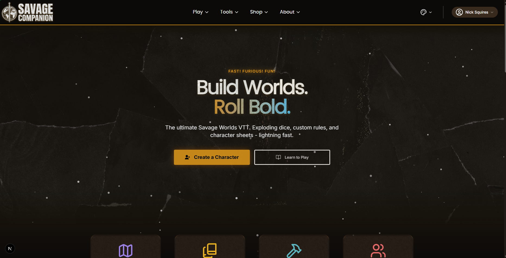
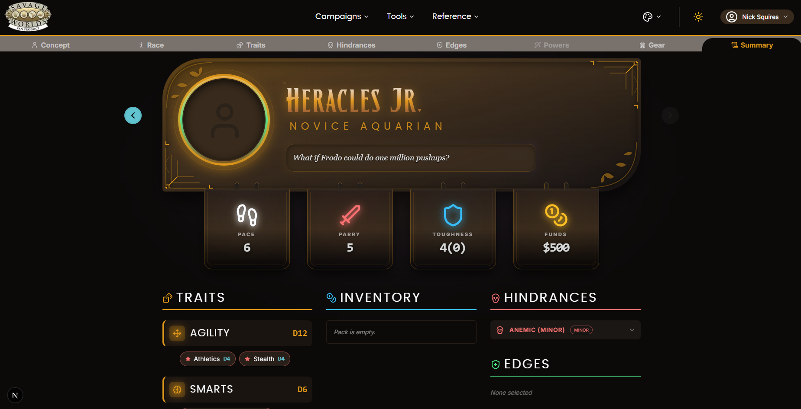
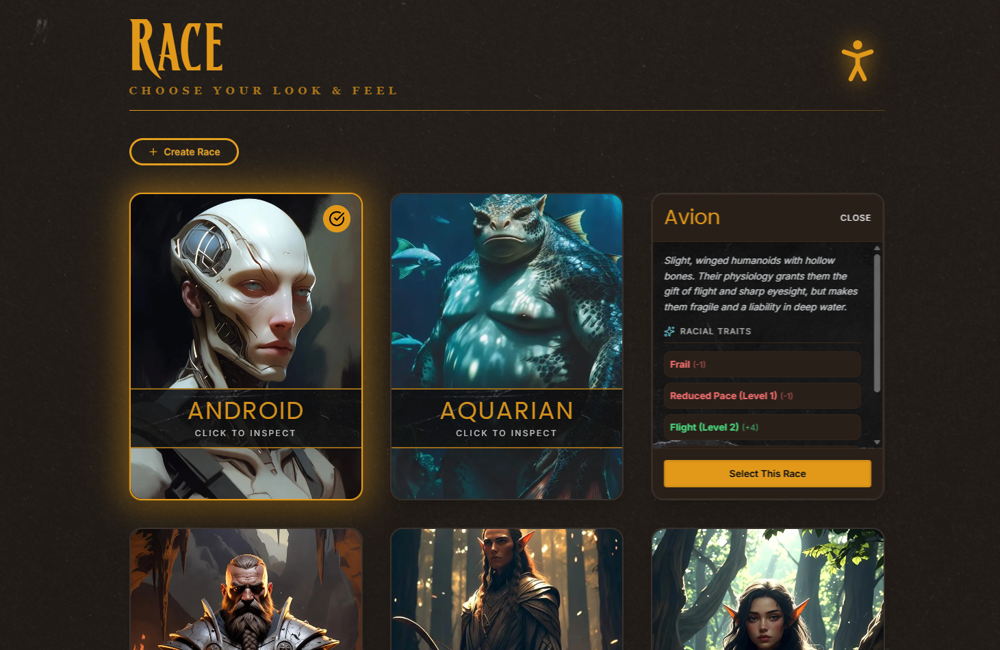
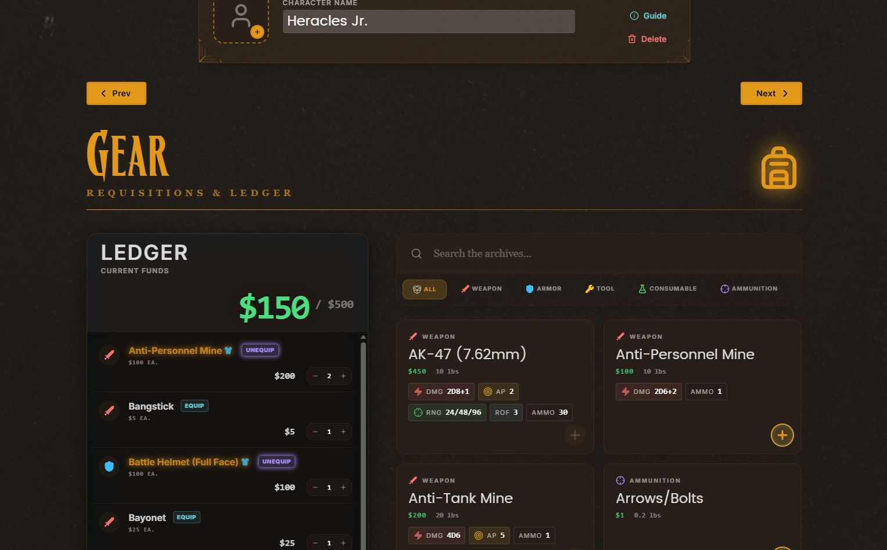
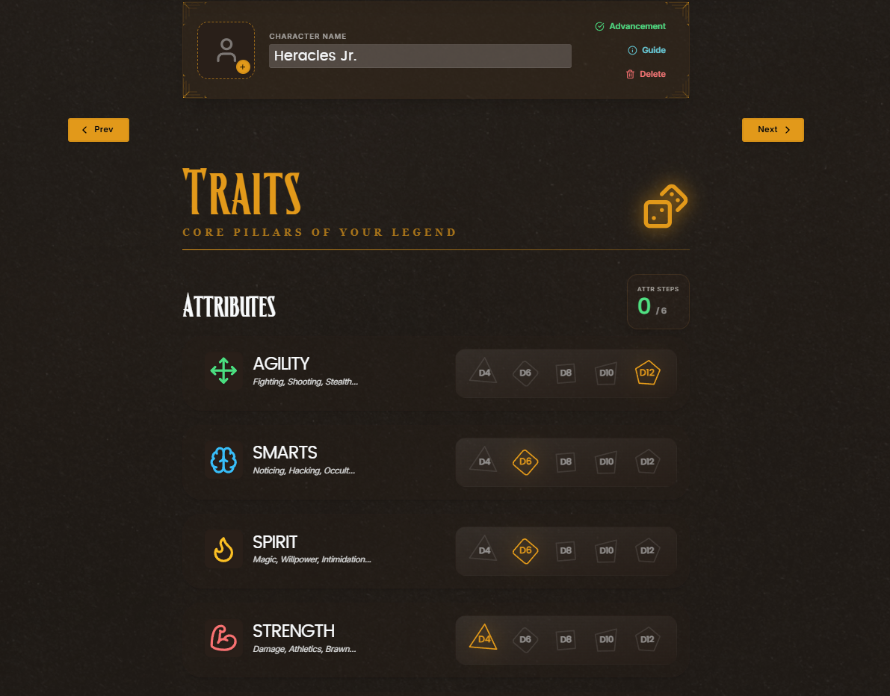
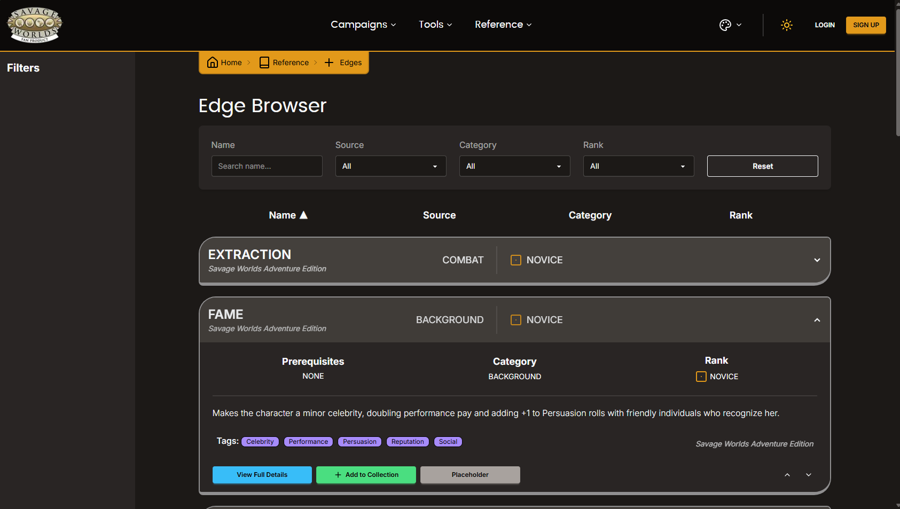

# Savage Worlds VTT Companion (Demo Sample - Unofficial Fan Product)

> A modern, full-stack companion web app for *Savage Worlds* (Adventure Edition) — built as a solo portfolio project.  
> Roll dice, resolve combat with all the “catch-all” modifiers, browse Edges/Hindrances/Powers, manage characters, and eventually play online with friends in a fully immersive VTT experience.

**Live Demo**: [https://savage-companion.vercel.app/](https://savage-companion.vercel.app/)

[](https://nextjs.org)
[](https://www.prisma.io)
[](https://www.typescriptlang.org)
[](https://tailwindcss.com)

## Project Context 
 
This project focuses on implementing a structured data model using Prisma and building intuitive multi-entity management interfaces. It is designed to showcase the handling of complex domain logic—specifically the deep mechanics of the *Savage Worlds* RPG—within a modern web architecture.

## ✨ Current Status (May 2026)

The project has transitioned from a backend rules-reference tool into a **Pre-Alpha Character Builder**. The foundation is now set for a persistent user experience, moving beyond static data into dynamic, state-driven character creation.

### ✅ Completed / Working Draft
- **Character Builder Architecture** – Pre-alpha prototype with dynamic tab routing, Zustand state management, and a custom rules engine for racial modifiers.
- **User Dashboard** – Authenticated user landing zone for managing characters and account settings.
- **Enhanced Auth** – NextAuth v5 integration with custom sign-in/sign-up flows and Google verification.
- **Rules Engine** – Roll & combat evaluator handling trait rolls, damage scaling, and penalty negation.
- **Advanced UI** – Integrated **shadcn/ui**, **Framer Motion** for interactive advancement bars, and accessibility-focused theme contrast adjustments.
- **Database layer** – Robust Prisma schema with join tables for complex relationships (Races, Edges, Hindrances, etc.) and complete JSON-based seeding.

### 🚧 In Progress
- **Character Sheet Editor** – Building the interface to beautifully view+modify existing characters, and track live transient stats like wounds/fatigue.
- **Homebrew Content Creation** – Drafting architecture for creating/managing community content and its availability to other users
- **Interactive Dice Roller** – Moving from logic-only to a visual UI with exploding die animations and status-effect integration.

## 🛠 Tech Stack

- **Framework**: Next.js 16 (App Router + Server Actions)
- **State Management**: Zustand (Client State) + React Server Components
- **Database**: Prisma ORM + MySQL
- **UI/UX**: Tailwind CSS, shadcn/ui, Framer Motion, and Lucide-react
- **Authentication**: NextAuth v5 (Auth.js)
- **Rules Logic**: Pure TypeScript domain modeling

## 🎨 Visual Assets & AI
To maintain development velocity during the prototyping phase, this project utilizes **AI-generated placeholder portraits** for races and characters. These assets are temporary and intended to visualize the UI layout; the long-term goal is to replace these with commissioned artwork from human artists prior to any official release.

## 🗺 Roadmap & Milestones

| Milestone | Status | Target |
| :--- | :---: | :---: |
| **Core Rules Engine** (Combat & Modifier Logic) | ✅ Done | Q1 2026 |
| **Character Builder Prototype** (Pre-Alpha) | ✅ Done | Q2 2026 |
| **Character Sheet Editor** (Live Tracking) | 🚧 In Progress | Q2 2026 |
| **Character Builder Finalization** | 📅 Planned | Q2 2026 |
| **Homebrew Content System** (Custom Edges/Races) | 📅 Planned | Q2 2026 |
| **Social System** (Friends, Groups, Messaging) | 📅 Planned | Q3 2026 |
| **Campaign Manager** (GM Tools & Session Logs) | 📅 Planned | Q3 2026 |
| **VTT Prototype** (Shared Maps & Initiative) | 📅 Planned | Q4 2026 |
| **Public Beta / Live Demo** | 📅 Planned | 2027 |

## 🚀 Getting Started

### Prerequisites
- Node.js 20+
- MySQL (or any Prisma-supported DB)
- Git

### 1. Clone & install
```bash
git clone https://github.com/nicksquires/savage-companion.git
cd savage-companion
npm install
```

### 2. Environment variables

Copy the example and fill in your keys:
```bash
cp .env.example .env.local
```

Required variables (see .env.example):
- DATABASE_URL
- NEXTAUTH_SECRET
- NEXTAUTH_URL
- Google OAuth credentials (optional but recommended)


### 3. Database
```bash
npx prisma generate
npx prisma db push          # or prisma migrate dev
npx prisma db seed          # loads Savage Worlds core entities
```

### 4. Run it
```bash
npm run dev
```
## 📸 Screenshots / Demo







(More GIFs and screenshots of the app will be added as soon as the UI gets its first proper coat of paint and more pages are added.)

## 🙌 Why This Project?
This is my capstone portfolio piece. It showcases:
  - Full-stack TypeScript architecture
  - Complex domain modeling (tabletop RPG rules)
  - Modern Next.js 15 patterns
  - Database design at scale
  - Auth + theming + real-time foundations

## 📜 License
This project is currently closed-source and all rights are reserved. The code is available publicly solely for portfolio and demonstration purposes. Please reach out if you have any questions regarding the implementation!

Fan License Note: This is a free, non-commercial unofficial Savage Worlds companion. It references the Savage Worlds rules system but does not reproduce any copyrighted material from the rulebook (no copy-paste of official text). See Pinnacle Entertainment Group’s Fan License for full details: https://peginc.com/licensing/
